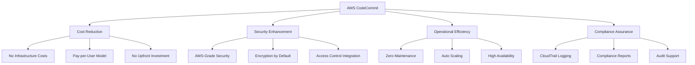

# AWS CodeCommit Service Overview

## Table of Contents
1. [What is AWS CodeCommit?](#what-is-aws-codecommit)
2. [Core Architecture and Components](#core-architecture-and-components)
3. [Service Features and Capabilities](#service-features-and-capabilities)
4. [Comparison with Other Git Providers](#comparison-with-other-git-providers)
5. [Regional Availability and Considerations](#regional-availability-and-considerations)
6. [Service Limits and Quotas](#service-limits-and-quotas)
7. [Cost Structure and Optimization](#cost-structure-and-optimization)
8. [Git Operations in CodeCommit](#git-operations-in-codecommit)
9. [Integration Ecosystem](#integration-ecosystem)

---

## What is AWS CodeCommit?

AWS CodeCommit is a fully managed source control service that hosts secure Git-based repositories. It eliminates the need to operate your own source control system or worry about scaling its infrastructure. CodeCommit is designed to work seamlessly with your existing Git tools and integrates natively with other AWS services.

### Core Value Propositions

#### 1. Fully Managed Infrastructure
- **Zero Infrastructure Management**: No servers to provision, patch, or maintain
- **Automatic Scaling**: Handles repositories of any size without configuration
- **High Availability**: Built on AWS's proven infrastructure with 99.9% SLA
- **Disaster Recovery**: Multi-AZ redundancy with automated failover

#### 2. Enterprise-Grade Security
- **Encryption Everywhere**: Data encrypted at rest and in transit by default
- **IAM Integration**: Fine-grained access control with AWS Identity and Access Management
- **VPC Support**: Private network access through VPC endpoints
- **Audit Trail**: Complete activity logging through AWS CloudTrail

#### 3. Native AWS Integration
- **Developer Tools**: Seamless integration with CodeBuild, CodeDeploy, CodePipeline
- **Monitoring**: Built-in CloudWatch metrics and events
- **Automation**: EventBridge integration for event-driven workflows
- **Security Services**: Integration with AWS Config, AWS Security Hub

### Key Business Benefits



---

## Core Architecture and Components

### CodeCommit Service Architecture

```
┌─────────────────────────────────────────────────────────────────┐
│                     AWS CodeCommit Service                     │
├─────────────────────────────────────────────────────────────────┤
│  ┌─────────────┐  ┌─────────────┐  ┌─────────────┐  ┌─────────┐  │
│  │ Repository  │  │ Repository  │  │ Repository  │  │   ...   │  │
│  │   Storage   │  │   Storage   │  │   Storage   │  │         │  │
│  │   Layer     │  │   Layer     │  │   Layer     │  │         │  │
│  └─────────────┘  └─────────────┘  └─────────────┘  └─────────┘  │
├─────────────────────────────────────────────────────────────────┤
│                    Security & Access Layer                      │
│  ┌─────────────┐  ┌─────────────┐  ┌─────────────┐              │
│  │     IAM     │  │  Resource   │  │    KMS      │              │
│  │  Policies   │  │   Policies  │  │ Encryption  │              │
│  └─────────────┘  └─────────────┘  └─────────────┘              │
├─────────────────────────────────────────────────────────────────┤
│                     Event & Automation Layer                    │
│  ┌─────────────┐  ┌─────────────┐  ┌─────────────┐              │
│  │ CloudWatch  │  │ EventBridge │  │   Lambda    │              │
│  │   Events    │  │    Rules    │  │  Functions  │              │
│  └─────────────┘  └─────────────┘  └─────────────┘              │
├─────────────────────────────────────────────────────────────────┤
│                      API & Interface Layer                      │
│  ┌─────────────┐  ┌─────────────┐  ┌─────────────┐              │
│  │   Git API   │  │  REST API   │  │ CloudWatch  │              │
│  │ (Git Proto) │  │ (HTTPS/CLI) │  │    API      │              │
│  └─────────────┘  └─────────────┘  └─────────────┘              │
└─────────────────────────────────────────────────────────────────┘
                                 │
                    ┌─────────────┴─────────────┐
                    │       Client Access       │
                    ├───────────┬───────────────┤
                    │   Git     │      AWS      │
                    │ Commands  │   CLI/SDK     │
                    │  & Tools  │   Console     │
                    └───────────┴───────────────┘
```

### Core Components Deep Dive

#### 1. Repository Storage Engine
```python
# Repository storage characteristics
REPOSITORY_FEATURES = {
    "git_compatibility": "Full Git protocol support",
    "encryption": {
        "at_rest": "AES-256 with AWS KMS",
        "in_transit": "TLS 1.2+ for all operations"
    },
    "versioning": "Complete Git history preservation",
    "metadata": "AWS-specific repository attributes",
    "performance": {
        "clone_speed": "Optimized for large repositories",
        "push_speed": "Delta compression and optimization"
    }
}
```

#### 2. Access Control Matrix
```python
# Multi-layered access control
ACCESS_CONTROL_LAYERS = {
    "authentication": [
        "IAM users and roles",
        "Federated users (SAML/OIDC)",
        "Cross-account access",
        "Temporary credentials (STS)"
    ],
    "authorization": [
        "IAM policies (identity-based)",
        "Resource policies (repository-based)",
        "Permission boundaries",
        "Service control policies (SCPs)"
    ],
    "conditional_access": [
        "IP address restrictions",
        "MFA requirements",
        "Time-based access",
        "VPC source restrictions"
    ]
}
```

#### 3. Event Processing Pipeline
```python
# Event flow architecture
EVENT_PIPELINE = {
    "triggers": [
        "Repository state changes",
        "Reference updates",
        "Pull request events",
        "Approval rule events"
    ],
    "processing": [
        "EventBridge rule matching",
        "Lambda function invocation",
        "SNS notification dispatch",
        "CloudWatch metrics update"
    ],
    "downstream_integration": [
        "CodePipeline execution",
        "CodeBuild project start",
        "Third-party webhooks",
        "Custom automation workflows"
    ]
}
```

---

## Service Features and Capabilities

### Git Protocol Support

#### Standard Git Operations
```bash
# Full Git compatibility demonstrated
git clone https://git-codecommit.region.amazonaws.com/v1/repos/repository-name
git add .
git commit -m "Standard Git workflow"
git push origin main
git branch feature/new-feature
git checkout feature/new-feature
git merge main
git tag v1.0.0
git push origin --tags
```

#### Advanced Git Features
```bash
# Git LFS support for large files
git lfs install
git lfs track "*.zip"
git lfs track "*.dmg"

# Partial clone capabilities
git clone --filter=blob:none <repository-url>

# Sparse checkout for large repositories
git config core.sparseCheckout true
echo "src/*" >> .git/info/sparse-checkout
git read-tree -m -u HEAD
```

### Repository Management Features

#### 1. Repository Creation Options
```python
# Comprehensive repository creation
import boto3

def create_advanced_repository():
    codecommit = boto3.client('codecommit')
    
    # Repository with all options
    response = codecommit.create_repository(
        repositoryName='enterprise-app-repo',
        repositoryDescription='Enterprise application repository with full features',
        tags={
            'Environment': 'Production',
            'Team': 'Platform-Engineering',
            'Project': 'Core-Services',
            'CostCenter': 'Engineering',
            'Compliance': 'SOC2',
            'DataClassification': 'Confidential'
        },
        kmsKeyId='arn:aws:kms:us-west-2:123456789012:key/12345678-1234-1234-1234-123456789012',
        # Initialize with existing code
        code={
            'S3': {
                'Bucket': 'initial-code-bucket',
                'Key': 'application-seed.zip'
            }
        }
    )
    
    return response
```

#### 2. Repository Configuration Management
```python
# Repository metadata and settings
def configure_repository_settings(repository_name):
    codecommit = boto3.client('codecommit')
    
    # Update repository description
    codecommit.update_repository_description(
        repositoryName=repository_name,
        repositoryDescription='Updated with governance metadata'
    )
    
    # Add/update tags for governance
    codecommit.tag_resource(
        resourceArn=f'arn:aws:codecommit:us-west-2:123456789012:{repository_name}',
        tags={
            'LastReviewed': '2024-01-01',
            'Owner': 'platform-team@company.com',
            'MaintenanceWindow': 'Sunday-0200UTC'
        }
    )
    
    # Configure repository triggers
    codecommit.put_repository_triggers(
        repositoryName=repository_name,
        triggers=[
            {
                'name': 'MainBranchProtection',
                'destinationArn': 'arn:aws:lambda:us-west-2:123456789012:function:BranchProtection',
                'events': ['updateReference'],
                'branches': ['main', 'master']
            },
            {
                'name': 'SecurityScan',
                'destinationArn': 'arn:aws:sns:us-west-2:123456789012:security-alerts',
                'events': ['all']
            }
        ]
    )
```

### Security and Compliance Features

#### 1. Encryption Configuration
```python
# KMS encryption management
def setup_repository_encryption():
    # Create dedicated KMS key for CodeCommit
    kms = boto3.client('kms')
    
    key_policy = {
        "Version": "2012-10-17",
        "Statement": [
            {
                "Sid": "Enable IAM policies",
                "Effect": "Allow",
                "Principal": {
                    "AWS": f"arn:aws:iam::{boto3.Session().region_name}:root"
                },
                "Action": "kms:*",
                "Resource": "*"
            },
            {
                "Sid": "Allow CodeCommit Service",
                "Effect": "Allow",
                "Principal": {
                    "Service": "codecommit.amazonaws.com"
                },
                "Action": [
                    "kms:Decrypt",
                    "kms:DescribeKey",
                    "kms:Encrypt",
                    "kms:GenerateDataKey*",
                    "kms:ReEncrypt*"
                ],
                "Resource": "*"
            }
        ]
    }
    
    key_response = kms.create_key(
        Policy=json.dumps(key_policy),
        Description='CodeCommit repository encryption key',
        Usage='ENCRYPT_DECRYPT',
        Origin='AWS_KMS',
        MultiRegion=False,
        Tags=[
            {
                'TagKey': 'Service',
                'TagValue': 'CodeCommit'
            },
            {
                'TagKey': 'Purpose',
                'TagValue': 'Repository-Encryption'
            }
        ]
    )
    
    return key_response['KeyMetadata']['KeyId']
```

#### 2. Audit and Compliance
```python
# Comprehensive audit configuration
def setup_audit_logging(repository_name):
    # Enable CloudTrail for CodeCommit events
    cloudtrail = boto3.client('cloudtrail')
    
    # Create dedicated trail for CodeCommit
    trail_response = cloudtrail.create_trail(
        Name='CodeCommitAuditTrail',
        S3BucketName='codecommit-audit-logs',
        S3KeyPrefix='codecommit/',
        IncludeGlobalServiceEvents=True,
        IsMultiRegionTrail=True,
        EnableLogFileValidation=True,
        EventSelectors=[
            {
                'ReadWriteType': 'All',
                'IncludeManagementEvents': True,
                'DataResources': [
                    {
                        'Type': 'AWS::CodeCommit::Repository',
                        'Values': [
                            f'arn:aws:codecommit:*:*:{repository_name}'
                        ]
                    }
                ]
            }
        ]
    )
    
    # Configure CloudWatch monitoring
    cloudwatch = boto3.client('cloudwatch')
    
    # Create custom dashboard for repository metrics
    cloudwatch.put_dashboard(
        DashboardName=f'CodeCommit-{repository_name}',
        DashboardBody=json.dumps({
            "widgets": [
                {
                    "type": "metric",
                    "properties": {
                        "metrics": [
                            ["AWS/CodeCommit", "RepositoryEvents", "RepositoryName", repository_name],
                            ["AWS/CodeCommit", "APIRequests", "RepositoryName", repository_name]
                        ],
                        "period": 300,
                        "stat": "Sum",
                        "region": "us-west-2",
                        "title": f"{repository_name} Activity"
                    }
                }
            ]
        })
    )
```

---

## Comparison with Other Git Providers

### Feature Matrix Comparison

| Feature Category | CodeCommit | GitHub Enterprise | GitLab Premium | Bitbucket Data Center |
|------------------|------------|-------------------|----------------|-----------------------|
| **Hosting Model** | AWS Managed | Cloud/On-Premises | Cloud/Self-hosted | Cloud/On-Premises |
| **Authentication** | IAM/Federation | OAuth/SAML/LDAP | OAuth/SAML/LDAP | OAuth/SAML/LDAP |
| **Repository Size** | Unlimited | 100GB limit | 10GB limit | Configurable |
| **File Size Limit** | 2GB per file | 100MB (LFS for larger) | 100MB (LFS for larger) | Configurable |
| **API Rate Limits** | 5,000/sec/region | 5,000/hour | 2,000/min | Configurable |
| **Built-in CI/CD** | Via CodePipeline | GitHub Actions | GitLab CI/CD | Bitbucket Pipelines |
| **Code Review** | Pull Requests | Pull Requests | Merge Requests | Pull Requests |
| **Issue Tracking** | No (use Jira/etc) | Yes | Yes | Via Jira integration |
| **Wiki/Docs** | No | Yes | Yes | Yes |
| **Package Registry** | No | Yes | Yes | No |
| **Security Scanning** | Via CodeGuru | GitHub Advanced Security | GitLab Security | No |
| **Compliance** | AWS Compliance | SOC2, ISO27001 | SOC2, ISO27001 | SOC2, ISO27001 |

### Cost Comparison Analysis

```python
# Cost calculation examples
def calculate_codecommit_costs(active_users_per_month):
    """
    CodeCommit pricing: $1 per active user per month
    First 5 users free
    """
    if active_users_per_month <= 5:
        return 0
    else:
        return (active_users_per_month - 5) * 1.00

def calculate_github_enterprise_costs(users, storage_gb=100):
    """
    GitHub Enterprise: $21 per user per month
    Includes 50GB storage, additional at $0.25/GB
    """
    base_cost = users * 21.00
    if storage_gb > 50:
        storage_cost = (storage_gb - 50) * 0.25
    else:
        storage_cost = 0
    
    return base_cost + storage_cost

# Example comparison for 50 users
codecommit_cost = calculate_codecommit_costs(50)  # $45/month
github_cost = calculate_github_enterprise_costs(50)  # $1,050/month

print(f"CodeCommit (50 users): ${codecommit_cost}/month")
print(f"GitHub Enterprise (50 users): ${github_cost}/month")
print(f"Cost savings with CodeCommit: ${github_cost - codecommit_cost}/month")
```

### Use Case Suitability

#### CodeCommit Best Fit Scenarios
```python
CODECOMMIT_IDEAL_SCENARIOS = {
    "aws_native_workflows": {
        "description": "Applications built entirely on AWS",
        "benefits": ["Native integration", "Simplified IAM", "Cost efficiency"]
    },
    "enterprise_security": {
        "description": "High security and compliance requirements",
        "benefits": ["AWS security controls", "Encryption", "Audit trails"]
    },
    "cost_sensitive": {
        "description": "Budget-conscious organizations",
        "benefits": ["Low cost per user", "No infrastructure overhead"]
    },
    "simple_source_control": {
        "description": "Teams needing just Git without extras",
        "benefits": ["Focused feature set", "No feature bloat"]
    }
}
```

#### When to Choose Alternatives
```python
ALTERNATIVE_SCENARIOS = {
    "integrated_devops_platform": {
        "recommendation": "GitLab",
        "reason": "Built-in CI/CD, issue tracking, package registry"
    },
    "open_source_community": {
        "recommendation": "GitHub",
        "reason": "Large community, discoverability, contribution model"
    },
    "atlassian_ecosystem": {
        "recommendation": "Bitbucket",
        "reason": "Tight integration with Jira and Confluence"
    },
    "air_gapped_environments": {
        "recommendation": "GitLab self-hosted",
        "reason": "Complete offline capability"
    }
}
```

---

## Regional Availability and Considerations

### Current Regional Footprint

```python
# CodeCommit regional availability (as of 2024)
CODECOMMIT_REGIONS = {
    "us_east": ["us-east-1", "us-east-2"],
    "us_west": ["us-west-1", "us-west-2"],
    "europe": [
        "eu-west-1", "eu-west-2", "eu-west-3", 
        "eu-central-1", "eu-north-1"
    ],
    "asia_pacific": [
        "ap-northeast-1", "ap-northeast-2", "ap-northeast-3",
        "ap-southeast-1", "ap-southeast-2", 
        "ap-south-1", "ap-east-1"
    ],
    "other": ["ca-central-1", "sa-east-1", "me-south-1"]
}

def get_optimal_region(user_location, data_residency_requirements=None):
    """
    Recommend optimal CodeCommit region based on requirements
    """
    recommendations = {
        "north_america": "us-east-1",  # Lowest latency for most US users
        "europe": "eu-west-1",         # Ireland - good connectivity
        "asia": "ap-southeast-1",      # Singapore - regional hub
        "australia": "ap-southeast-2", # Sydney
        "canada": "ca-central-1",      # Data residency
        "south_america": "sa-east-1"   # São Paulo
    }
    
    if data_residency_requirements:
        # Override based on compliance requirements
        if data_residency_requirements == "EU_GDPR":
            return "eu-west-1"
        elif data_residency_requirements == "CANADA_PIPEDA":
            return "ca-central-1"
    
    return recommendations.get(user_location, "us-east-1")
```

### Multi-Region Strategy Considerations

#### 1. Repository Distribution Strategy
```python
def design_multi_region_strategy(requirements):
    """
    Design multi-region repository distribution
    """
    strategy = {
        "primary_region": requirements["primary_region"],
        "backup_regions": [],
        "replication_method": None,
        "considerations": []
    }
    
    if requirements["disaster_recovery"]:
        strategy["backup_regions"] = [
            get_backup_region(requirements["primary_region"])
        ]
        strategy["replication_method"] = "automated_backup_to_s3"
        strategy["considerations"].append("Cross-region backup automation")
    
    if requirements["global_teams"]:
        strategy["considerations"].extend([
            "Regional mirror repositories for performance",
            "Synchronization workflows between regions",
            "Consistent IAM policies across regions"
        ])
    
    if requirements["compliance"]:
        strategy["considerations"].extend([
            "Data residency compliance",
            "Region-specific encryption keys",
            "Audit trail consolidation"
        ])
    
    return strategy

# Example usage
enterprise_requirements = {
    "primary_region": "us-east-1",
    "disaster_recovery": True,
    "global_teams": True,
    "compliance": True
}

strategy = design_multi_region_strategy(enterprise_requirements)
```

#### 2. Cross-Region Repository Backup
```python
import boto3
import json

class CrossRegionBackupManager:
    def __init__(self, primary_region, backup_region):
        self.primary_region = primary_region
        self.backup_region = backup_region
        
        self.primary_codecommit = boto3.client('codecommit', region_name=primary_region)
        self.backup_s3 = boto3.client('s3', region_name=backup_region)
        
    def setup_cross_region_backup(self, repository_name, backup_bucket):
        """
        Set up automated cross-region backup
        """
        # Create Lambda function for backup automation
        lambda_function = self.create_backup_lambda(repository_name, backup_bucket)
        
        # Create EventBridge rule for repository changes
        self.create_backup_event_rule(repository_name, lambda_function['FunctionArn'])
        
        return {
            "status": "success",
            "backup_function": lambda_function['FunctionArn'],
            "backup_destination": f"s3://{backup_bucket}/codecommit-backups/"
        }
    
    def create_backup_lambda(self, repository_name, backup_bucket):
        """
        Create Lambda function for repository backup
        """
        lambda_client = boto3.client('lambda', region_name=self.primary_region)
        
        function_code = """
import boto3
import subprocess
import tempfile
import os
from datetime import datetime

def lambda_handler(event, context):
    codecommit = boto3.client('codecommit')
    s3 = boto3.client('s3', region_name=os.environ['BACKUP_REGION'])
    
    repository_name = os.environ['REPOSITORY_NAME']
    backup_bucket = os.environ['BACKUP_BUCKET']
    
    with tempfile.TemporaryDirectory() as temp_dir:
        # Clone repository
        repo_info = codecommit.get_repository(repositoryName=repository_name)
        clone_url = repo_info['repositoryMetadata']['cloneUrlHttp']
        
        subprocess.run([
            'git', 'clone', '--mirror', clone_url, f'{temp_dir}/{repository_name}.git'
        ], check=True)
        
        # Create archive
        timestamp = datetime.now().strftime('%Y%m%d-%H%M%S')
        archive_name = f'{repository_name}-backup-{timestamp}.tar.gz'
        
        subprocess.run([
            'tar', '-czf', f'{temp_dir}/{archive_name}',
            '-C', temp_dir, f'{repository_name}.git'
        ], check=True)
        
        # Upload to S3
        s3_key = f'codecommit-backups/{repository_name}/{archive_name}'
        s3.upload_file(f'{temp_dir}/{archive_name}', backup_bucket, s3_key)
        
        return {
            'statusCode': 200,
            'body': f'Backup completed: {s3_key}'
        }
        """
        
        return lambda_client.create_function(
            FunctionName=f'codecommit-backup-{repository_name}',
            Runtime='python3.9',
            Role=f'arn:aws:iam::{boto3.client("sts").get_caller_identity()["Account"]}:role/LambdaCodeCommitBackupRole',
            Handler='index.lambda_handler',
            Code={'ZipFile': function_code.encode()},
            Environment={
                'Variables': {
                    'REPOSITORY_NAME': repository_name,
                    'BACKUP_BUCKET': backup_bucket,
                    'BACKUP_REGION': self.backup_region
                }
            },
            Timeout=900,
            MemorySize=512
        )
```

---

## Service Limits and Quotas

### Current Service Limits

```python
# CodeCommit service limits (2024)
SERVICE_LIMITS = {
    "repositories": {
        "max_per_account": 1000,  # Soft limit, can be increased
        "max_size": "No limit",
        "max_files": "No limit"
    },
    "files": {
        "max_file_size": "2 GB",
        "recommended_file_size": "100 MB"
    },
    "operations": {
        "api_requests_per_second": 5000,
        "concurrent_git_connections": 4000,
        "git_push_rate": "No specific limit"
    },
    "repository_triggers": {
        "max_per_repository": 10,
        "max_branches_per_trigger": 100
    },
    "approval_rules": {
        "max_per_repository": 1000,
        "max_approval_pool_members": 100
    }
}
```

### Monitoring and Managing Limits

```python
import boto3
import json

class CodeCommitLimitMonitor:
    def __init__(self):
        self.codecommit = boto3.client('codecommit')
        self.cloudwatch = boto3.client('cloudwatch')
        
    def check_repository_usage(self):
        """
        Monitor repository count against limits
        """
        repositories = self.codecommit.list_repositories()
        repo_count = len(repositories['repositories'])
        
        # Check against soft limit
        utilization_percent = (repo_count / 1000) * 100
        
        if utilization_percent > 80:
            self.send_limit_warning(
                "Repository Count",
                repo_count,
                1000,
                utilization_percent
            )
        
        return {
            "current_count": repo_count,
            "limit": 1000,
            "utilization_percent": utilization_percent
        }
    
    def monitor_api_usage(self):
        """
        Monitor API request rates
        """
        # Get CloudWatch metrics for API usage
        response = self.cloudwatch.get_metric_statistics(
            Namespace='AWS/CodeCommit',
            MetricName='APIRequests',
            Dimensions=[
                {
                    'Name': 'Operation',
                    'Value': 'All'
                }
            ],
            StartTime=datetime.utcnow() - timedelta(minutes=5),
            EndTime=datetime.utcnow(),
            Period=300,
            Statistics=['Sum']
        )
        
        if response['Datapoints']:
            latest_requests = response['Datapoints'][-1]['Sum']
            requests_per_second = latest_requests / 300
            
            # Check against rate limit
            if requests_per_second > 4000:  # 80% of 5000 limit
                self.send_rate_limit_warning(requests_per_second)
        
        return response
    
    def send_limit_warning(self, metric_name, current_value, limit, utilization):
        """
        Send warning when approaching limits
        """
        sns = boto3.client('sns')
        
        message = f"""
        CodeCommit Limit Warning
        
        Metric: {metric_name}
        Current Value: {current_value}
        Limit: {limit}
        Utilization: {utilization:.2f}%
        
        Consider:
        - Requesting limit increase
        - Archiving unused repositories
        - Optimizing usage patterns
        """
        
        sns.publish(
            TopicArn='arn:aws:sns:us-west-2:123456789012:codecommit-alerts',
            Subject=f'CodeCommit Limit Warning: {metric_name}',
            Message=message
        )
```

### Limit Optimization Strategies

```python
def optimize_repository_usage():
    """
    Strategies for optimizing CodeCommit usage
    """
    optimization_strategies = {
        "repository_consolidation": {
            "description": "Combine related projects into monorepos",
            "benefits": ["Reduced repo count", "Simplified management"],
            "considerations": ["Team workflow impact", "Permission boundaries"]
        },
        "archive_unused_repos": {
            "description": "Archive repositories with no recent activity",
            "implementation": "Move to S3 with metadata preservation",
            "criteria": ["No commits in 6+ months", "No active branches"]
        },
        "large_file_optimization": {
            "description": "Use Git LFS for large binary files",
            "benefits": ["Reduced clone times", "Better performance"],
            "setup": "Configure .gitattributes for file patterns"
        },
        "api_rate_management": {
            "description": "Implement API request caching and batching",
            "techniques": ["Client-side caching", "Batch operations", "Rate limiting"]
        }
    }
    
    return optimization_strategies
```

---

This comprehensive service overview provides the foundation for understanding AWS CodeCommit's capabilities, architecture, and positioning within the broader DevOps ecosystem. The content covers both basic concepts and advanced enterprise considerations needed for the DevOps Engineer Professional certification.